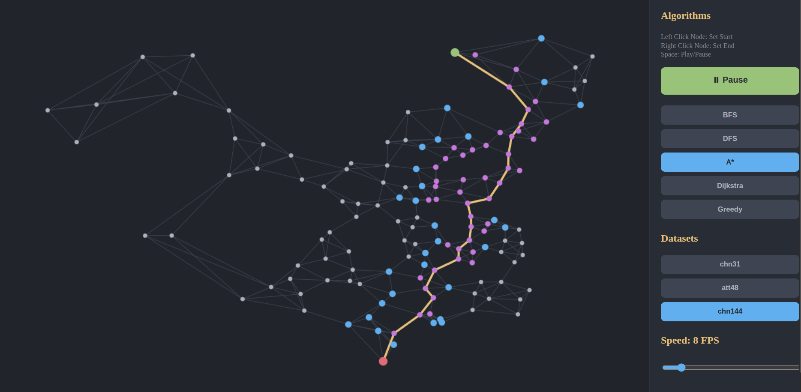

# 🗺️ Search Algorithms Visualizer

> An interactive web application built with **Angular 18** to visualize classic pathfinding and search algorithms in action! 🚀



## Features

- **Interactive Map:** Watch how different algorithms explore the given space step-by-step.
- **Multiple Algorithms Supported:** 
  - **A\* Search (A-Star)**
  - **Breadth-First Search (BFS)**
  - **Depth-First Search (DFS)**
  - **Dijkstra's Algorithm**
  - **Greedy Best-First Search**
- **Interactive Visualization:** The core logic leverages TypeScript generators to allow step-by-step animation of the pathfinding process, making it easy to understand how each algorithm explores nodes.
- **Modern UI:** Clean, responsive, and user-friendly interface built with Angular components.

## Built With

- **[Angular](https://angular.dev/)** (v18) - Web framework for modern UI.
- **TypeScript** - For robust type-safe algorithm implementations.
- **RxJS** - For state management and reactive programming.

## Getting Started

Follow these simple steps to get a local copy up and running.

### Prerequisites

Make sure you have Node.js and the Angular CLI installed on your machine.
```bash
npm install -g @angular/cli
```

### Installation

1. Clone the repository
   ```bash
   git clone https://github.com/carlosrs14/search-algorithms.git
   ```
2. Navigate to the project directory
   ```bash
   cd search-algorithms
   ```
3. Install NPM packages
   ```bash
   npm install
   ```

### Running the App

Run `npm start` or `ng serve` for a development server. Navigate to `http://localhost:4200/`. The application will automatically reload if you change any of the source files.

## Build

Run `npm run build` or `ng build` to compile the project. The build artifacts will be stored in the `dist/` directory, ready for deployment (e.g., GitHub Pages).

## Contributing

Contributions, issues, and feature requests are welcome! Feel free to check the issues page.

---
*xlancet*
